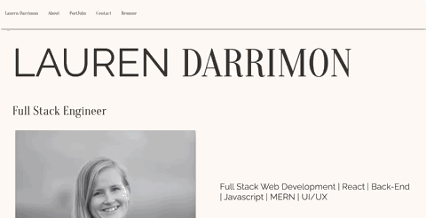

# Web Development Portfolio
## Lauren Darrimon
    
    
### Description
Single page React application for web development professional site using React, ReactDOM, Formspree, Bootstrap, AOS animations, and deployed to GitHub Pages. 

### Table of Contents

* [Link](#link)
* [Installation](#installation)
* [Usage](#usage)
* [Contributing](#contributing)
* [Tests](#tests)
* [Questions](#questions)
* [License](#license)

### Link 
🔗 
Link to application [portfolio](https://laurendarrimon.github.io/portfolio/)

### Installation
🔧
In order for this application to work, you need to install the following dependencies: Node.js, React, ReactDOM, Bootsrap, AOS, React Icons, GitHub Pages and Formspree. To install, run: 

~~~
 npm i 
~~~

### Usage 
To run the application in development mode and see it at [http://localhost:3000](http://localhost:3000) in your browser you can run the script: 

~~~
npm start 
~~~

To bundle your application into the build folder in preparation for deployment, run the script: 

~~~
npm run build 
~~~

### Contributing 
✍️ 
Lauren Darrimon is the author of this application. Find additional work on Lauren Darrimon's [Github profile.](http://github.com/laurenDarrimon).

### Questions
❓💌
Reach out to Lauren Darrimon at hello@laurenlalita.com if you have any questions. 

### License
The license for this project is: [MIT](https://opensource.org/licenses/MIT)

### Learn More

Learn more in the [Create React App documentation](https://facebook.github.io/create-react-app/docs/getting-started).

